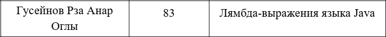
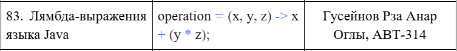
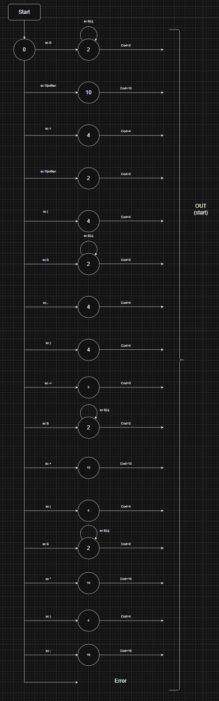

# Разработка лексического анализатора (сканера)

## Цель работы
Изучить назначение и принципы работы лексического анализатора в структуре компилятора. 
Спроектировать алгоритм (диаграмму состояний) и выполнить программную реализацию сканера 
для выделения лексем из входного текста. Интегрировать разработанный модуль в ранее созданный 
графический интерфейс языкового процессора.

## Автор
**ФИО:** Гусейнов Рза Анар оглы  
**Группа:** АВТ-314  
**Учебное заведение:** НГТУ

---

## Постановка задачи
Разработать лексический анализатор (сканер) в соответствии с индивидуальным вариантом задания, интегрировать его в приложение из лабораторной работы №1 и обеспечить наглядный вывод результатов.

### Требования к реализации сканера:

- Спроектировать диаграмму состояний конечного автомата, реализующего сканер, согласно варианту задания.

- Разработать программный модуль лексического анализа, который:

  - принимает на вход строку (исходный текст программы);

  - выделяет все допустимые лексемы согласно варианту;

  - классифицирует лексемы по типам (например: "ключевое слово", "идентификатор", "число", "оператор", "разделитель").

  - любые символы, не соответствующие ни одному из допустимых типов лексем, считать недопустимыми и выводить сообщение об ошибке с указанием позиции.

  - учитывает многострочность входного текста.

### Требования к интеграции и интерфейсу:

-  сканер в ранее разработанный интерфейс и связать его с кнопкой "Пуск" и соответствующим пунктом меню.

- Область вывода результатов (элемент DataGridView или аналогичная таблица) должна содержать следующие столбцы:

  1. Условный код (числовой идентификатор типа лексемы).

  2. Тип лексемы (текстовое описание).

  3. Лексема (выделенная подстрока).

  4. Местоположение (номер строки, начальная и конечная позиция символов).

- Реализовать навигацию по ошибкам: при щелчке на сообщении об ошибке в таблице результатов курсор в области редактирования должен устанавливаться на позицию недопустимого символа.

---

## Вариант задания

### Примеры корректных входных данных:

- *operation = (x, y, z) -> x + (y * z);*

- *var calc = (int a) -> { return a * 2; };*

- *String msg = () -> "Hello";*

### Перечень допустимых лексем (на основе анализатора):

- Целое число (Код 1): последовательность цифр.

- Идентификатор (Код 2): последовательность букв, цифр, символов _ и \$, начинающаяся с буквы, _ или $.

- Лямбда оператор (Код 3): ->.

- Разделитель (Код 4): символы *"("*, *")"*, *"{"*, *"}"*, *","*, *"."*.

- Строковый литерал (Код 5): текст, заключенный в двойные *"* или одинарные *'* кавычки.

- Оператор (Код 10): символы +, -, *, /, =, <, >, ++, --.

- Разделитель (пробел/перенос) (Код 11): пробелы, табуляция, переносы строк.

- Ключевое слово (Код 14): зарезервированные слова (int, double, float, boolean, char, 
 byte, short, long, var, void, return, String, new).

- Конец оператора (Код 16): символ ;.

- Ошибка (Код 17): недопустимый символ или незакрытая строка.

---

## Диаграмма состояний

---

## Тестовые примеры

Условный код	Тип лексемы	Лексема	Местоположение
2	идентификатор	operation	строка 1, 1-9
11	разделитель (пробел/перенос)	(пробел)	строка 1, 10-10
10	оператор	#ERROR!	строка 1, 11-11
11	разделитель (пробел/перенос)	(пробел)	строка 1, 12-12
4	разделитель	(	строка 1, 13-13
2	идентификатор	x	строка 1, 14-14
4	разделитель	)	строка 1, 15-15
11	разделитель (пробел/перенос)	(пробел)	строка 1, 16-16
3	лямбда оператор	->	строка 1, 17-18
11	разделитель (пробел/перенос)	(пробел)	строка 1, 19-19
2	идентификатор	x	строка 1, 20-20
11	разделитель (пробел/перенос)	(пробел)	строка 1, 21-21
10	оператор	*	строка 1, 22-22
11	разделитель (пробел/перенос)	(пробел)	строка 1, 23-23
1	целое число	2	строка 1, 24-24
16	конец оператора	;	строка 1, 25-25
